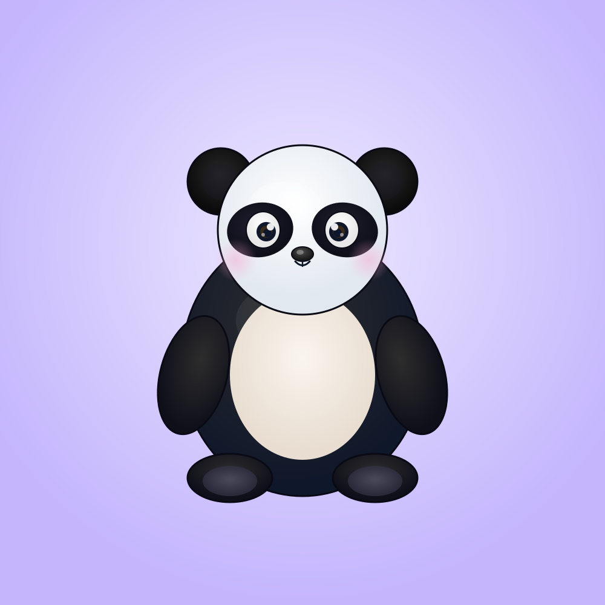
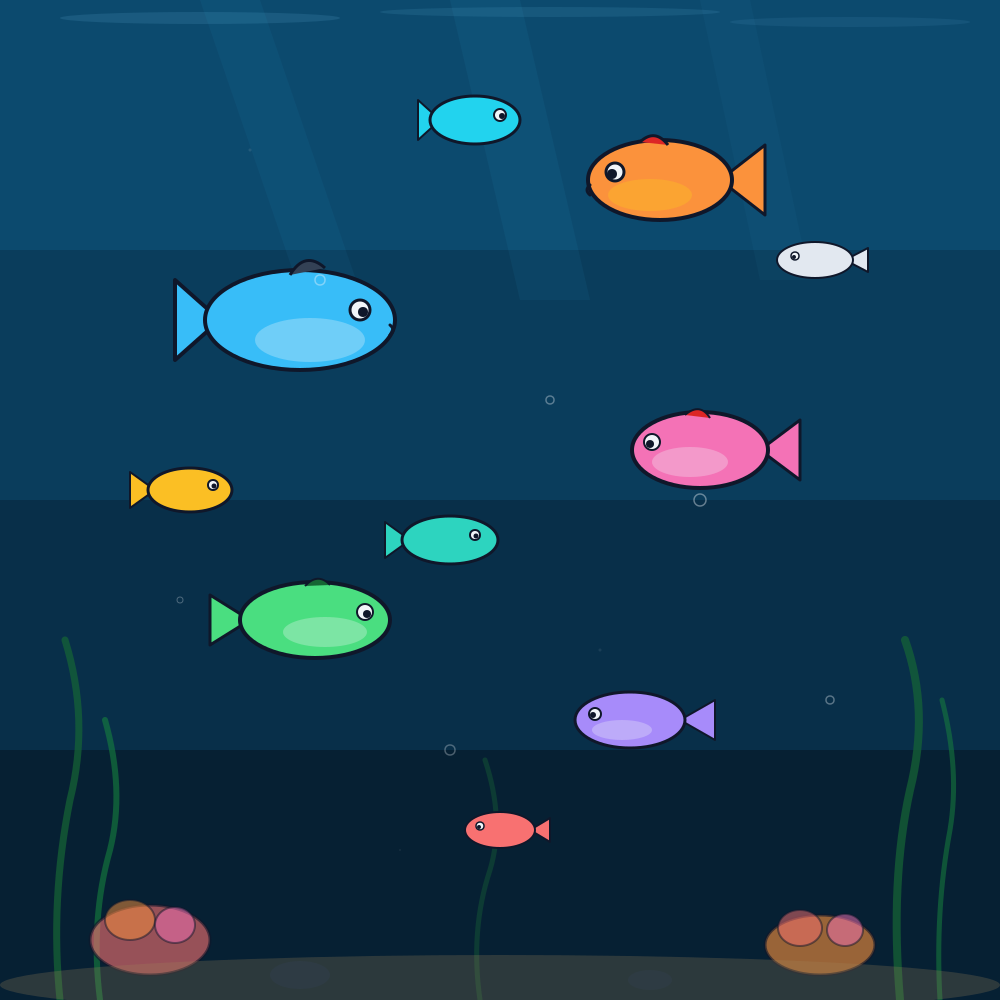
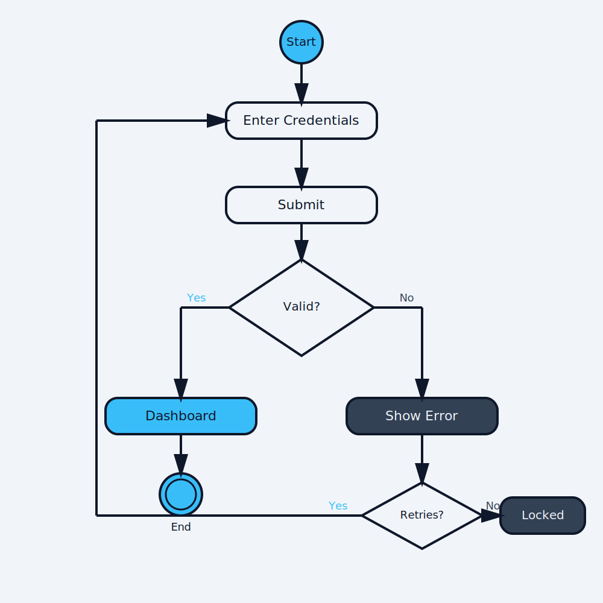
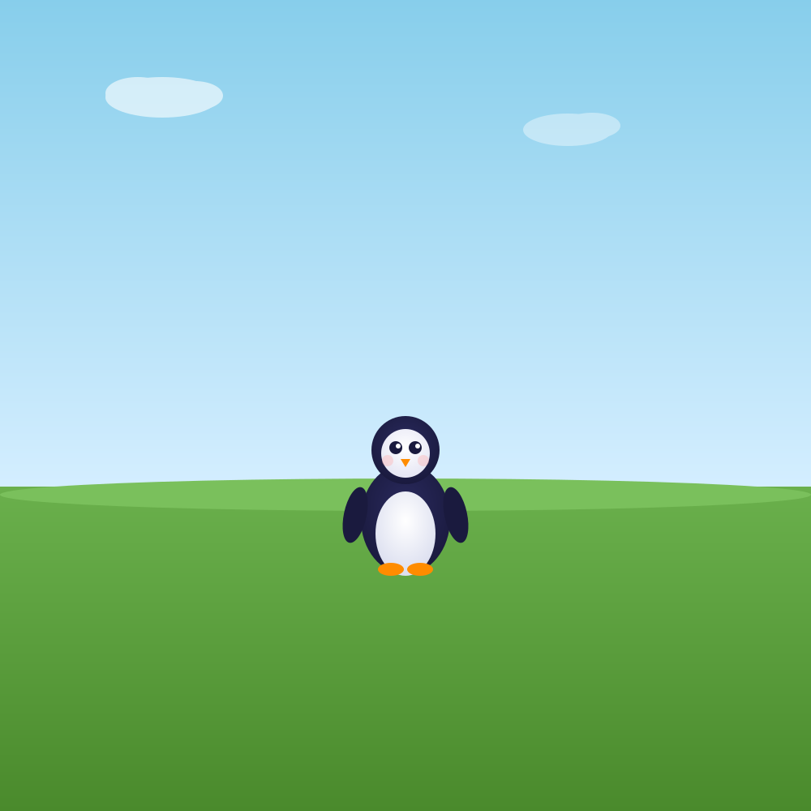
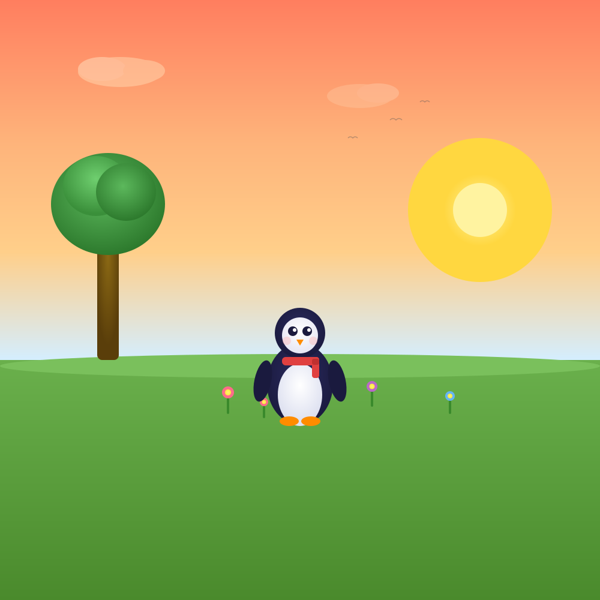

# Baybee

SVG drawing and animation plugin for [Claude Code](https://docs.anthropic.com/en/docs/claude-code). Turn natural language into illustrated SVG graphics — characters, scenes, diagrams, and animations.

## Examples

> "draw a panda"



> "draw a beach scene with a shack"



> "draw a neon cat icon"



> "animate fish swimming in an ocean"



> "draw a flowchart for user login"



## Install

```
claude install gh:Sreerajta/baybee
```

## Usage

Just ask Claude Code to draw something. Baybee activates automatically for drawing, illustration, and SVG requests.

```
draw a panda sitting in a bamboo forest
draw a beach scene with palm trees and a shack
draw a flowchart for user authentication
draw a neon cat icon
animate a bird flying
```

You can also edit existing illustrations incrementally:

```
add a tree to the scene
make the panda bigger
change the sky to sunset colors
animate the fish swimming
```

Output is written as `.svg` files in your working directory.

### Iterative editing in action

Start with a simple scene, then build on it with follow-up prompts:

| "draw a penguin on grass" | → "add a tree, flowers, a scarf, and change the sky to sunset" |
|:---:|:---:|
|  |  |

Each edit modifies the existing SVG — the penguin stays exactly where it is while new elements are added around it.

## What it's great at

- **Geometric art style** — Characters and animals are built from simple shapes (circles, ellipses, rectangles, polygons). This isn't a limitation — it's a deliberate design choice. LLMs can place geometric primitives with precision, producing a consistent logo-art aesthetic that looks clean and intentional every time.
- **Polished shading with gradients** — `<radialGradient>` on rounded surfaces, `<linearGradient>` on flat ones. Gradients only need percentage coordinates, which LLMs handle reliably — so you get depth, highlights, and shading without the unpredictability of complex paths.
- **Pure SVG, zero dependencies** — Output is a single `.svg` file. No JavaScript, no build step, no runtime. It renders in any browser, scales to any size, and is trivially embeddable.
- **Iterative scene building** — Build illustrations conversationally. Start with a character, add a background, place objects, tweak colors, add animation — one prompt at a time, without losing what you've already built.
- **Native SVG animation** — Breathing, swimming, flying, wagging, swaying, drifting — all using `<animate>` and `<animateTransform>`. No JS, no CSS, just SVG that moves.
- **Semantic structure** — Every element gets a group ID (`<g id="panda-1">`). You can reference any part of the scene by name to move it, restyle it, or animate it.
- **Scenes, diagrams, and procedural content** — Multi-layered environments, flowcharts, architecture diagrams, and procedurally generated groups (forests, starfields, skylines) with natural variation.

## What to expect

Baybee produces **illustrated, geometric SVG art** — not photorealistic images. Here's what that means in practice:

| Expectation | Reality |
|-------------|---------|
| Photorealistic rendering | Geometric/logo art style — charming, not realistic |
| Complex organic curves | Shapes are built from circles, ellipses, and polygons — not freehand bezier paths |
| Pixel-perfect consistency | LLM-generated — output quality can vary between runs. Iteration helps. |
| 3D or perspective | Flat 2D compositions with layering for depth. No perspective projection. |
| Complex keyframe animation | SVG SMIL animation primitives — oscillation, translation, rotation, scaling. Not full timeline animation. |
| Arbitrary canvas sizes | Fixed 1000x1000 `viewBox` (scales to any display size, but the internal coordinate space is fixed) |
| Production design tool | A creative tool for illustrations, prototyping, and fun — not a replacement for Figma or Illustrator |

**Best suited for:** Icons, mascots, illustrated scenes, children's book art, diagrams, quick visual prototypes, educational graphics, and anything where a clean geometric style works.

**Not ideal for:** Photorealism, detailed human portraits, complex typography layouts, or precision technical drawings.

## How it works

Baybee is composed of 15 skills that handle different aspects of SVG rendering:

| Skill | What it does |
|-------|-------------|
| `baybee` | Core illustration engine — geometric character construction, anatomy, shading |
| `baybee-plan` | Request router — analyzes prompts and orchestrates the right rendering modules |
| `baybee-scene` | Scene composition — layered environments with depth and spatial structure |
| `baybee-edit` | Incremental editing — add, remove, or modify elements in existing SVGs |
| `baybee-select` | Object targeting — select elements by natural language ("the cow", "all trees") |
| `baybee-spatial` | Spatial reasoning — interprets "next to", "above", "behind", etc. |
| `baybee-procedural` | Procedural generation — forests, starfields, groups of repeated elements |
| `baybee-rig` | Character rigging — grouped body parts for independent animation |
| `baybee-motion` | Physics-inspired motion — oscillation, easing, secondary animation |
| `baybee-style` | Visual styles — polished, minimal, cartoon, neon, pixel, wireframe |
| `baybee-layout` | Spatial arrangement — grids, alignment, spacing, margins |
| `baybee-complexity` | Detail control — minimal, simple, normal, detailed, highly detailed |
| `baybee-diagram` | Diagram rendering — flowcharts, architecture diagrams, wireframes |
| `baybee-debug` | Debug overlays — layout grids, bounding boxes, zone visualization |
| `baybee-validate` | SVG validation — structural checks, repair, and correction |

## License

MIT
